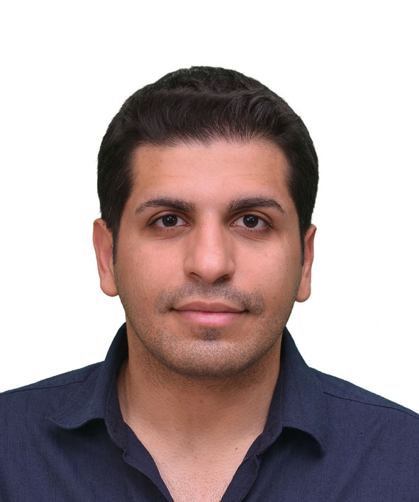
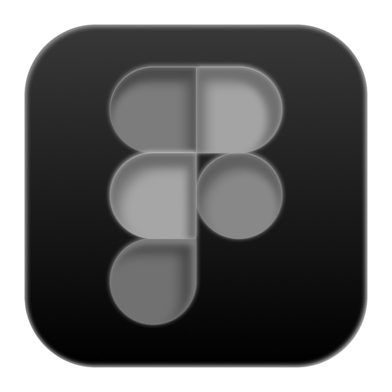
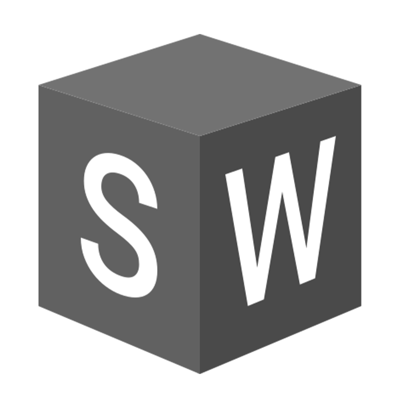
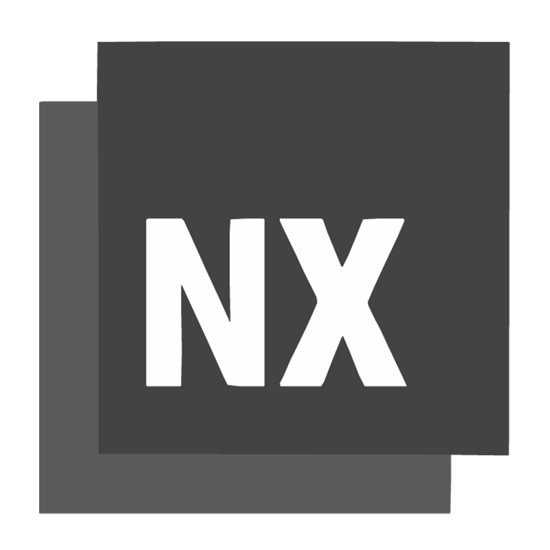

---

## Hakkımda

---

{width=150}

## Miraç Beltekin

**Proje Mühendisi**

**İletişim:** mirac.beltekin@gmail.com · Ankara, Türkiye

---

## Eğitim

**Hacettepe Üniversitesi**  

*2026 - Devam Ediyor*  

Mühendislik Yönetimi, Yüksek Lisans

**Gazi Üniversitesi**  

*2016 - 2021*  

Endüstriyel Tasarım Mühendisliği, Lisans

---

## Deneyim

**Tripy Mobility Teknoloji A.Ş.**  

*Ekim 2022 - Devam Ediyor*  

Proje Mühendisi

**MİA Teknoloji A.Ş.**  

*Haziran 2020 - Ekim 2022*  

Endüstriyel Tasarım Mühendisi

**MFK Makina**  

*Temmuz 2019*  

Stajyer Mühendis

**Özben Savunma**  

*Temmuz 2018*  

Stajyer Mühendis

---

## Sertifikalar

- PMI Onaylı PMP® Sertifikası Eğitimi

- Google UX Design Sertifikası

- Google AI Essentials Sertifikası

- İHA-2 Pilotluk Lisansı

- AS 9100: Havacılık/Savunma Standartları

- IATF 16949: Otomotiv Kalite Standartları

---

## Yetkinlikler

- Uçtan Uca Ürün Yönetimi

- Kapsam, Değişim ve Risk Yönetimi

- Zaman ve Maliyet Planlaması

- Ürün Geliştirme ve Üretim Takibi

- Çevik ve Hibrit Proje Yönetimi

- Saha Operasyonu ve Test Süreçleri

- Paydaş Katılımı ve İletişim Yönetimi

---

## Program Bilgisi

| | |
|:---|:---|
| {width=32} Microsoft Office | {width=32} AutoCAD |
| | |
| {width=32} Figma | {width=32} Fusion 360 |
| | |
| {width=32} Jira | {width=32} SolidWorks |
| | |
| {width=32} MS Project | {width=32} Catia |
| | |
| {width=32} Photoshop | {width=32} Illustrator |
| | |
| {width=32} Inventor | {width=32} Siemens NX |

---

**[CV'mi PDF olarak indir](assets/Mirac-Beltekin-CV.pdf)**