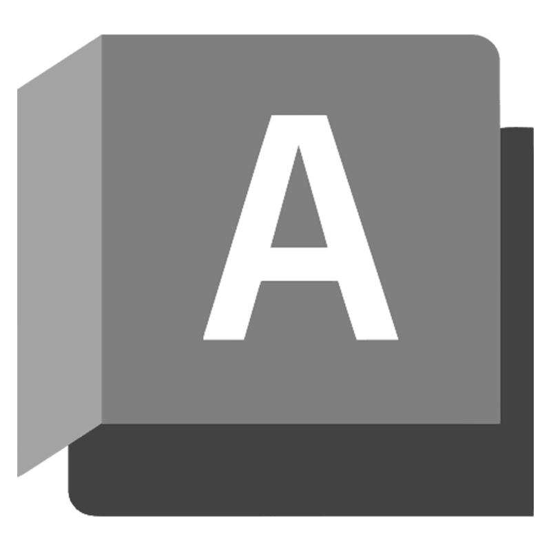
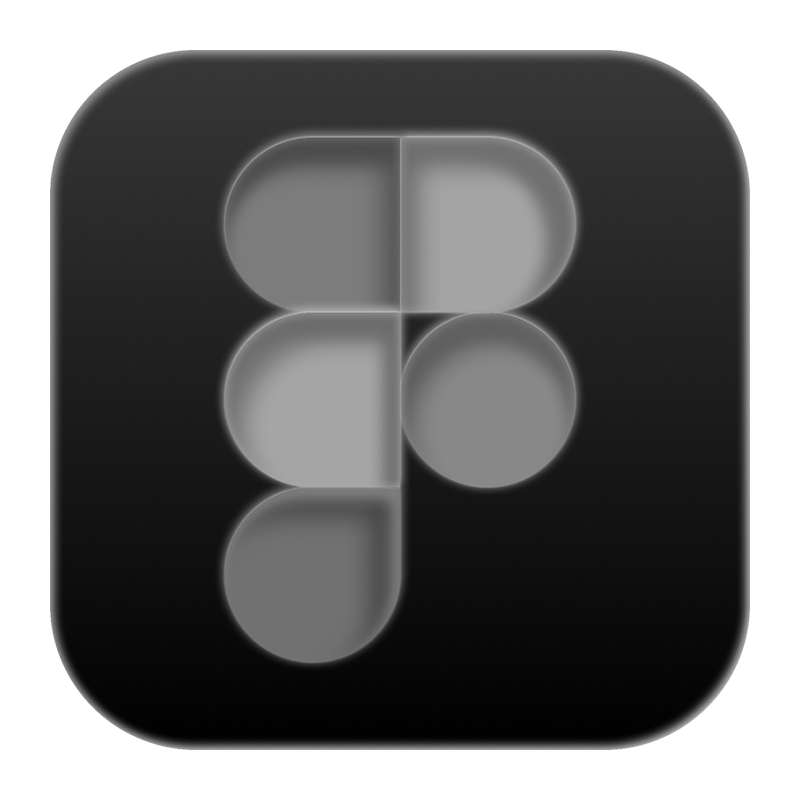
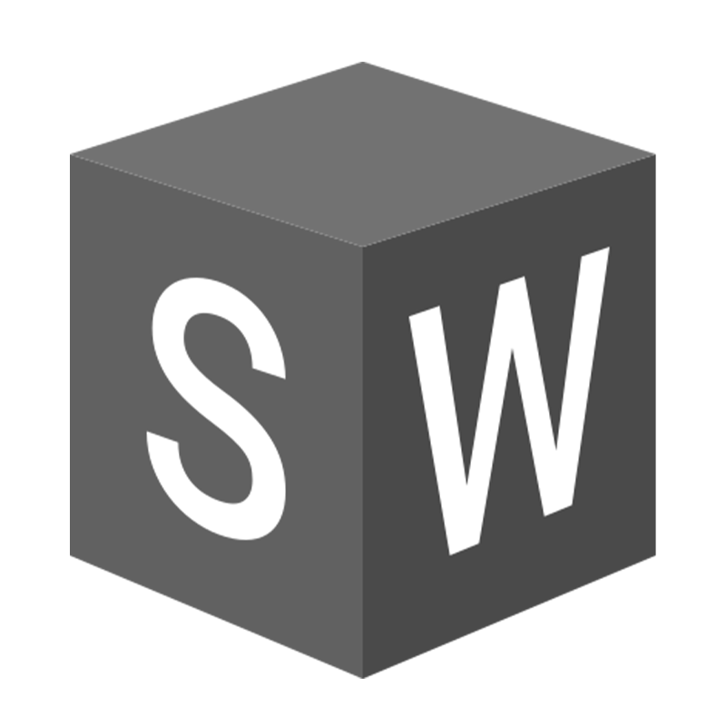
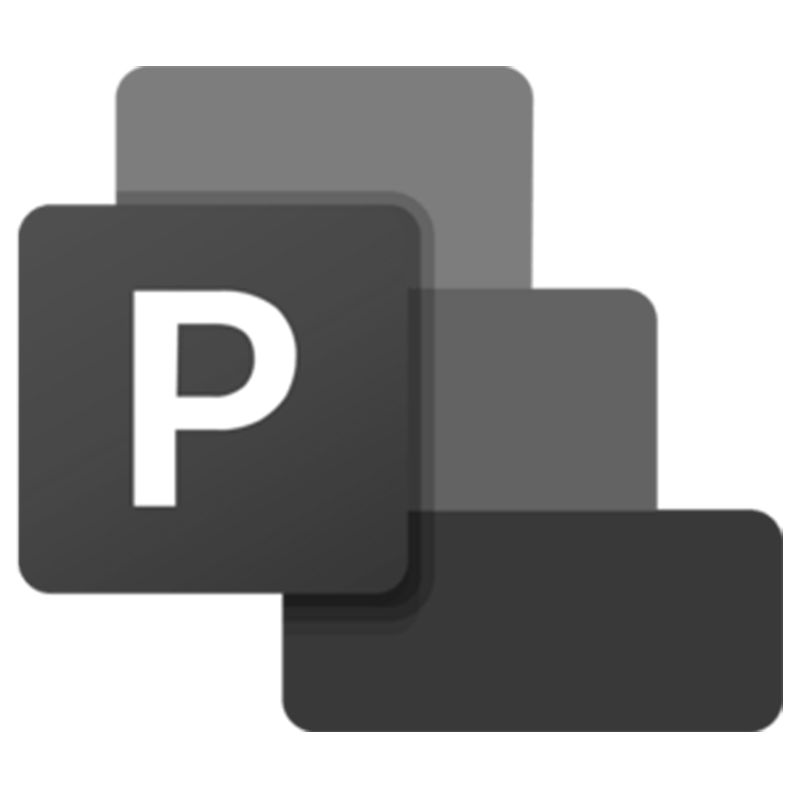
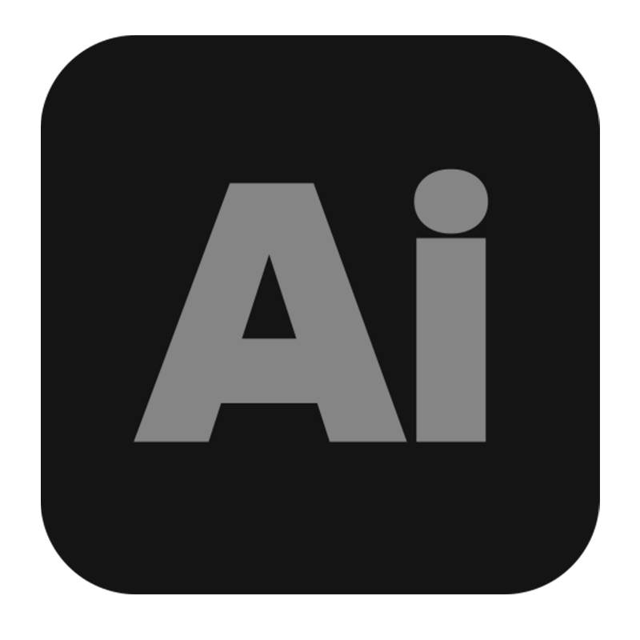
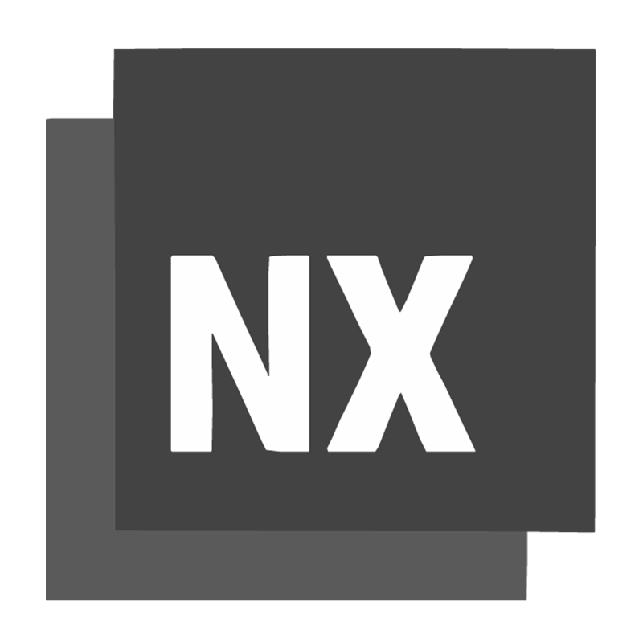

```{=html}
<!-- ========== PROFİL HERO ========== -->
<section class="profile-hero">
  <div class="profile-photo-wrap">
    
  </div>
  <div class="profile-role-label">
    <span class="hero-label-dot"></span>
    Proje Mühendisi · Ankara
  </div>
  <h1 class="profile-name">Miraç Beltekin</h1>
  <p class="profile-tagline">
    Endüstriyel tasarım mühendisliği lisansı, beş yıllık proje mühendisliği deneyimi ve mühendislik yönetimi yüksek lisansı ile ürün geliştirme süreçlerini veri analitiği perspektifiyle birleştiriyorum.
  </p>
  <div class="profile-meta">
    <span class="profile-meta-item">
      
      <a href="mailto:mirac.beltekin@gmail.com">mirac.beltekin@gmail.com</a>
    </span>
    <span class="profile-meta-item">
      
      <a href="https://github.com/miracbeltekin" target="_blank">miracbeltekin</a>
    </span>
    <span class="profile-meta-item">
      
      <a href="https://www.linkedin.com/in/miracbeltekin" target="_blank">miracbeltekin</a>
    </span>
  </div>
</section>

<!-- ========== EĞİTİM ========== -->
<section class="section-wrap">
  <span class="section-label">01 — Eğitim</span>
  <h2 class="section-title">Akademik geçmiş</h2>

  <div class="timeline">

    <div class="timeline-item">
      <div class="timeline-period">2026 — Devam Ediyor</div>
      <div class="timeline-title">Hacettepe Üniversitesi</div>
      <div class="timeline-subtitle">Mühendislik Yönetimi · Yüksek Lisans</div>
    </div>

    <div class="timeline-item">
      <div class="timeline-period">2016 — 2021</div>
      <div class="timeline-title">Gazi Üniversitesi</div>
      <div class="timeline-subtitle">Endüstriyel Tasarım Mühendisliği · Lisans</div>
    </div>

  </div>
</section>

<!-- ========== DENEYİM ========== -->
<section class="section-wrap">
  <span class="section-label">02 — Deneyim</span>
  <h2 class="section-title">Profesyonel deneyim</h2>

  <div class="timeline">

    <div class="timeline-item">
      <div class="timeline-period">Ekim 2022 — Devam Ediyor</div>
      <div class="timeline-title">Tripy Mobility Teknoloji A.Ş.</div>
      <div class="timeline-subtitle">Proje Mühendisi</div>
    </div>

    <div class="timeline-item">
      <div class="timeline-period">Haziran 2020 — Ekim 2022</div>
      <div class="timeline-title">MİA Teknoloji A.Ş.</div>
      <div class="timeline-subtitle">Endüstriyel Tasarım Mühendisi</div>
    </div>

    <div class="timeline-item">
      <div class="timeline-period">Temmuz 2019</div>
      <div class="timeline-title">MFK Makina</div>
      <div class="timeline-subtitle">Stajyer Mühendis</div>
    </div>

    <div class="timeline-item">
      <div class="timeline-period">Temmuz 2018</div>
      <div class="timeline-title">Özben Savunma</div>
      <div class="timeline-subtitle">Stajyer Mühendis</div>
    </div>

  </div>
</section>

<!-- ========== SERTİFİKALAR ========== -->
<section class="section-wrap">
  <span class="section-label">03 — Sertifikalar</span>
  <h2 class="section-title">Profesyonel sertifikalar</h2>

  <div class="cert-grid">
    <div class="cert-item">PMI Onaylı PMP® Sertifikası Eğitimi</div>
    <div class="cert-item">Google UX Design Sertifikası</div>
    <div class="cert-item">Google AI Essentials Sertifikası</div>
    <div class="cert-item">İHA-2 Pilotluk Lisansı</div>
    <div class="cert-item">AS 9100: Havacılık / Savunma</div>
    <div class="cert-item">IATF 16949: Otomotiv Kalite</div>
  </div>
</section>

<!-- ========== YETKİNLİKLER ========== -->
<section class="section-wrap">
  <span class="section-label">04 — Yetkinlikler</span>
  <h2 class="section-title">Uzmanlık alanları</h2>

  <div class="skill-grid">
    <div class="skill-item">Uçtan uca ürün yönetimi</div>
    <div class="skill-item">Kapsam, değişim ve risk yönetimi</div>
    <div class="skill-item">Zaman ve maliyet planlaması</div>
    <div class="skill-item">Ürün geliştirme ve üretim takibi</div>
    <div class="skill-item">Çevik ve hibrit proje yönetimi</div>
    <div class="skill-item">Saha operasyonu ve test süreçleri</div>
    <div class="skill-item">Paydaş katılımı ve iletişim yönetimi</div>
  </div>
</section>

<!-- ========== PROGRAM BİLGİSİ — İKONLU ========== -->
<section class="section-wrap">
  <span class="section-label">05 — Yazılım</span>
  <h2 class="section-title">Kullandığım programlar</h2>

  <div class="software-grid">
    <div class="software-item">
      
      Microsoft Office
    </div>
    <div class="software-item">
      
      AutoCAD
    </div>
    <div class="software-item">
      
      Figma
    </div>
    <div class="software-item">
      
      Fusion 360
    </div>
    <div class="software-item">
      
      Jira
    </div>
    <div class="software-item">
      
      SolidWorks
    </div>
    <div class="software-item">
      
      MS Project
    </div>
    <div class="software-item">
      
      Catia
    </div>
    <div class="software-item">
      
      Photoshop
    </div>
    <div class="software-item">
      
      Illustrator
    </div>
    <div class="software-item">
      
      Inventor
    </div>
    <div class="software-item">
      
      Siemens NX
    </div>
  </div>
</section>

<!-- ========== CTA ========== -->
<section class="cta-band">
  <h2 class="cta-title">Birlikte çalışmaya açığım</h2>
  <p class="cta-subtitle">
    Proje yönetimi, ürün geliştirme veya veri analitiği konularında iletişime geçebilirsin.
  </p>
  <div class="cta-actions">
    <a href="mailto:mirac.beltekin@gmail.com" class="btn-bogaz">
      mirac.beltekin@gmail.com
    </a>
    <a href="https://www.linkedin.com/in/miracbeltekin" class="btn-ghost" target="_blank">
      LinkedIn
    </a>
  </div>
</section>
```
